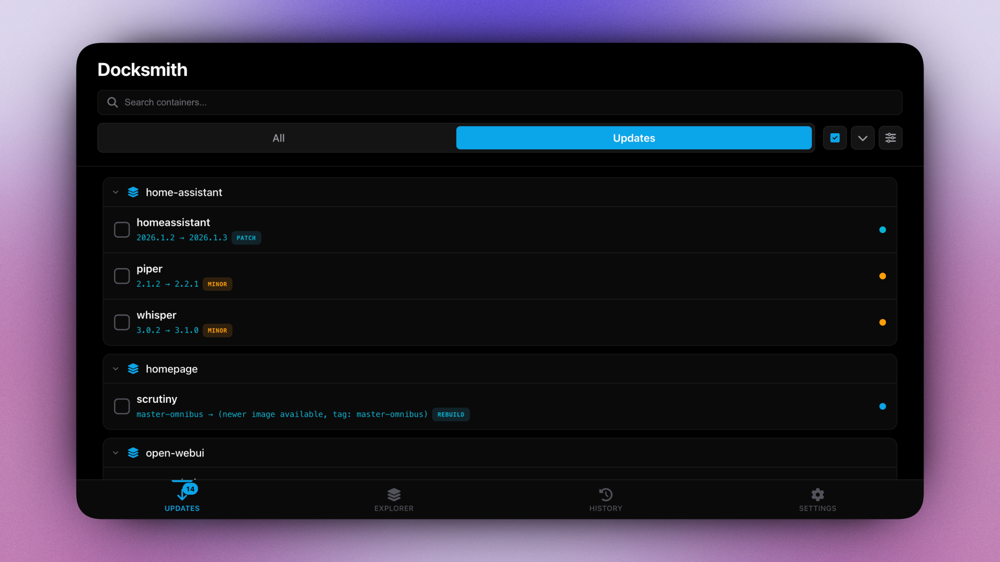
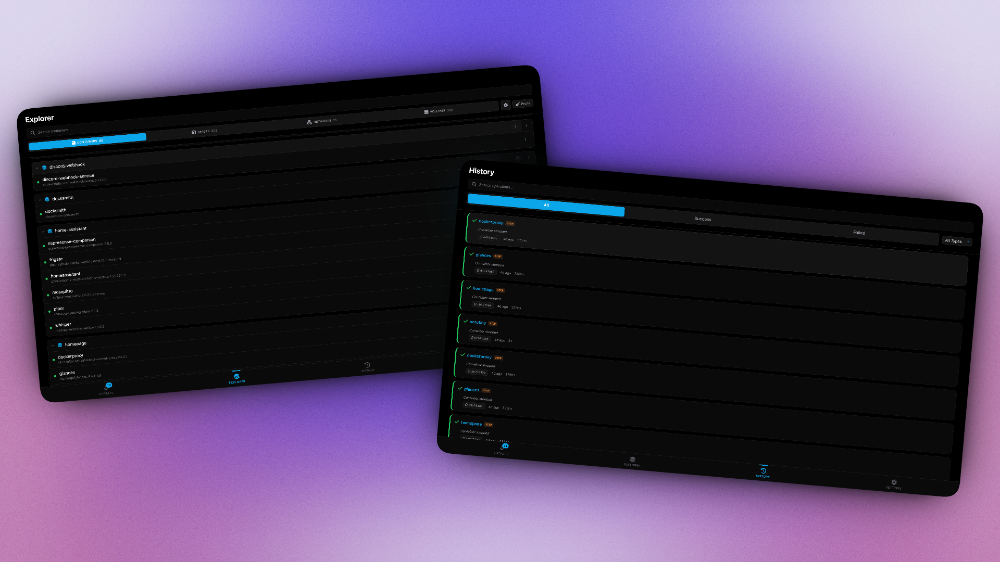

<p align="center">
  
</p>

<p align="center">
  <strong>A Docker container update manager for self-hosters.</strong><br>
  Monitor your compose stacks, check for newer versions, and manage updates through a web UI.
</p>

<p align="center">
  <a href="https://github.com/chrisae9/docksmith/blob/main/LICENSE"></a>
  <a href="https://github.com/chrisae9/docksmith/pkgs/container/docksmith"></a>
</p>

<p align="center">
  
</p>

---

## Quick Start

```bash
docker run -d \
  --name docksmith \
  -p 8080:8080 \
  -v /var/run/docker.sock:/var/run/docker.sock \
  -v ./data:/data \
  -v /home/user/stacks:/home/user/stacks:rw \
  ghcr.io/chrisae9/docksmith:latest
```

Open **http://localhost:8080** — that's it.

<details>
<summary><strong>Docker Compose</strong></summary>

```yaml
services:
  docksmith:
    image: ghcr.io/chrisae9/docksmith:latest
    container_name: docksmith
    restart: unless-stopped
    ports:
      - "8080:8080"
    volumes:
      - /var/run/docker.sock:/var/run/docker.sock
      - ./data:/data
      - /home/user/stacks:/home/user/stacks:rw
```

```bash
docker compose up -d
```

</details>

Mount your compose directories with `:rw` so Docksmith can update image tags in your compose files.

> **Tip**: If your compose files use `env_file`, mount with the same path inside and outside the container:
> ```
> -v /home/user/stacks:/home/user/stacks:rw
> ```
> This ensures Docker can find your `.env` files when Docksmith recreates containers.

---

## What It Does

**Updates** — Checks Docker Hub, GHCR, and [private registries](docs/registries.md) for newer image versions. Update containers individually or in batches. Rollback if something breaks.

**Version Control** — [Pin to major/minor versions](docs/labels.md#version-constraint-labels), filter tags with regex, or set version bounds. Useful for databases and other apps where you don't want surprise major upgrades.

**Pre-Update Checks** — Run [scripts](docs/scripts.md) before updates. Block an update if Plex has active streams, backup a database first, or check disk space.

**Explorer** — Browse and manage containers, images, networks, and volumes. Stop, start, restart, remove containers. Prune unused resources.

<p align="center">
  
</p>

**Dependency Handling** — Automatically restart containers that depend on updated services (like apps using a VPN container). See [restart-after label](docs/labels.md#docksmithrestart-after).

---

## Configuration

| Variable | Default | Description |
|----------|---------|-------------|
| `CHECK_INTERVAL` | `5m` | How often to check for updates |
| `CACHE_TTL` | `1h` | Registry response cache duration |
| `DB_PATH` | `/data/docksmith.db` | Database location |
| `LOG_LEVEL` | `info` | Log level (debug, info, warn, error) |
| `GITHUB_TOKEN` | - | For private GHCR images |

For private registries, mount your Docker config. See [registry setup](docs/registries.md).

---

## Security

Docksmith has no built-in authentication. It should only be accessed on trusted networks. See [integrations](docs/integrations.md) for deployment with Tailscale.

---

## More Info

- [Labels](docs/labels.md) — Version constraints, pre-update checks, auto-rollback
- [Scripts](docs/scripts.md) — Pre-update script examples
- [Registries](docs/registries.md) — Docker Hub, GHCR, private registries
- [Integrations](docs/integrations.md) — Homepage widget, Tailscale, Traefik
- [API](docs/api.md) — REST API reference

