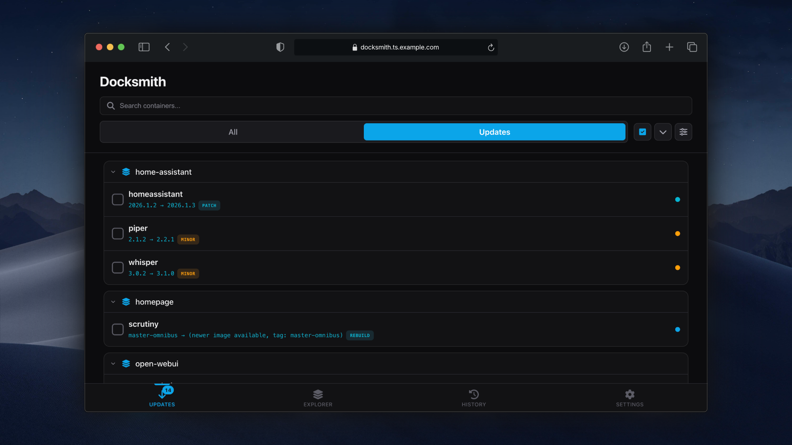

<p align="center">
  
</p>

<p align="center">
  <strong>A Docker container update manager for self-hosters.</strong><br>
  Monitor your compose stacks, check for newer versions, and manage updates through a web UI.
</p>

<p align="center">
  <a href="https://github.com/chrisae9/docksmith/actions/workflows/build.yml"></a>
  <a href="https://github.com/chrisae9/docksmith/releases"></a>
  <a href="https://go.dev/"></a>
  <a href="https://github.com/chrisae9/docksmith/blob/main/LICENSE"></a>
  <a href="https://github.com/chrisae9/docksmith/pkgs/container/docksmith"></a>
</p>

<p align="center">
  
</p>

---

## Quick Start

```yaml
services:
  docksmith:
    image: ghcr.io/chrisae9/docksmith:latest
    container_name: docksmith
    restart: unless-stopped
    ports:
      - "8080:8080"
    volumes:
      # Required: Docker socket for container management
      - /var/run/docker.sock:/var/run/docker.sock
      # Required: Persistent storage for update history
      - ./data:/data
      # Optional: Docker config for registry authentication (GHCR, private registries)
      - ~/.docker/config.json:/root/.docker/config.json:ro
      # Your compose directories (add as many as needed)
      # Use same path inside/outside so env_file references work
      - /home/user/stacks:/home/user/stacks:rw
```

---

## Why I Built This

I was using [What's Up Docker](https://github.com/fmartinou/whats-up-docker) with most of my containers running on `latest` tags and felt like I didn't have much control over updates. I wanted something focused on semantic version detection and management for docker compose stacks.

A few specific problems I kept running into:

- **No container dependencies** - Updating certain containers (like a VPN) would break others that depended on them. I'd have to SSH into my server and manually restart things. Docksmith handles this with the `restart-after` label.

- **No way to block risky updates** - I could never tell if someone was watching Plex before an update kicked off. Now I use pre-update checks to block updates when there are active streams.

- **Wanted VS Code Docker on mobile** - I love the [VS Code Docker extension](https://github.com/microsoft/vscode-docker) for managing containers, but wanted that same control from my phone. The Explorer tab is basically that.

---

## What It Does

**Updates** - Checks Docker Hub, GHCR, and [private registries](docs/registries.md) for newer image versions. Update containers individually or in batches. Rollback if something breaks.

**Version Control** - [Pin to major/minor versions](docs/labels.md#version-constraint-labels), filter tags with regex, or set version bounds. Useful for databases and other apps where you don't want surprise major upgrades.

**Pre-Update Checks** - Run [scripts](docs/scripts.md) before updates. Block an update if Plex has active streams, backup a database first, or check disk space.

**Explorer** - Browse and manage containers, images, networks, and volumes. Stop, start, restart, remove containers. Prune unused resources.

**Dependency Handling** - Automatically restart containers that depend on updated services (like apps using a VPN container). See [restart-after label](docs/labels.md#docksmithrestart-after).

**History** - Track all updates, rollbacks, and operations. See what changed and when.

---

## Configuration

| Variable | Default | Description |
|----------|---------|-------------|
| `CHECK_INTERVAL` | `5m` | How often to check for updates |
| `CACHE_TTL` | `1h` | Registry response cache duration |
| `DB_PATH` | `/data/docksmith.db` | Database location |
| `LOG_LEVEL` | `info` | Log level (debug, info, warn, error) |
| `GITHUB_TOKEN` | - | For private GHCR images |

### Registry Authentication

Mount your Docker config to authenticate with registries:

```yaml
volumes:
  - ~/.docker/config.json:/root/.docker/config.json:ro
```

This enables access to private images and avoids Docker Hub rate limits. See [registry setup](docs/registries.md) for details.

---

## Security

Docksmith requires access to the Docker socket, which grants full control over your containers. There is no built-in authentication - **do not expose it to the internet**.

Run it on a trusted network or behind [Tailscale](docs/integrations.md).

---

## More Info

- [Labels](docs/labels.md) - Version constraints, pre-update checks, auto-rollback
- [Scripts](docs/scripts.md) - Pre-update script examples
- [Registries](docs/registries.md) - Docker Hub, GHCR, private registries
- [Integrations](docs/integrations.md) - Homepage widget, Tailscale, Traefik
- [API](docs/api.md) - REST API reference
